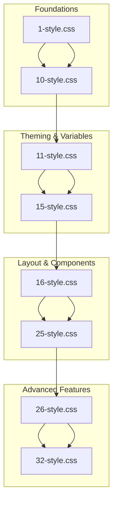

# CSS Advanced Project

## Overview

The CSS Advanced Project is a comprehensive journey into modern web styling techniques. This project covers a range of CSS capabilities including theming, responsive design, advanced transitions, and transformations. Each task builds upon the last, culminating in a sophisticated set of styles for a web application.

## Directory Structure

### Files Overview
- **styles/**: Contains CSS files from `1-style.css` to `32-style.css`. Each file corresponds to a specific task, representing stages of enhancement in the styling of the web application.
- **images/**: Directory containing placeholder files for required images which need to be replaced by high-resolution images sourced from Unsplash.
- **README.md**: This comprehensive documentation file.

### CSS File Structure (32 files total)
- **Lines of code range**: From 4 lines (1-style.css) to 860 lines (32-style.css)
- **Total lines**: 13,697 lines of CSS code across all files
- **Progressive enhancement**: Each file builds upon the previous, adding new features and refinements

## Detailed CSS Files Overview

### Phase 1: Foundation (Tasks 1-10)
**Files**: `1-style.css` to `10-style.css`
- **Purpose**: Basic structure and global resets
- **Key Features**:
  - Smooth scrolling implementation
  - Normalize.css integration for cross-browser consistency
  - Basic typography and layout foundations
  - Initial element styling and resets

### Phase 2: Theming & Variables (Tasks 11-15)
**Files**: `11-style.css` to `15-style.css`
- **Purpose**: Establishing design system with CSS custom properties
- **Key Features**:
  - CSS variables for colors, typography, and spacing
  - Consistent color palette implementation
  - Font family and size standardization
  - Base theme establishment

**Example from 13-style.css**:
```css
:root {
  --color-primary: #d73953;
  --color-black: #090909;
  --color-white: #ffffff;
  --font-family-base: "Open Sans", "Helvetica Neue", Helvetica, Arial, sans-serif;
  --font-family-title: "Raleway", "Helvetica Neue", Helvetica, Arial, sans-serif;
  --font-size-small: 1.2rem;
  --font-size-medium: 1.6rem;
  --font-size-large: 1.8rem;
}
```

### Phase 3: Layout & Components (Tasks 16-25)
**Files**: `16-style.css` to `25-style.css`
- **Purpose**: Component-specific styling and layout systems
- **Key Features**:
  - Grid systems and responsive layouts
  - Navigation styling and interactions
  - Card components and content sections
  - Button styling with hover states
  - Footer and header implementations

### Phase 4: Advanced Features (Tasks 26-32)
**Files**: `26-style.css` to `32-style.css`
- **Purpose**: Advanced CSS techniques and animations
- **Key Features**:
  - CSS transformations and transitions
  - Pseudo-element decorations
  - Interactive hover effects
  - Animation timing functions
  - Complex layout behaviors

## Technical Highlights

### Custom Properties System
The project extensively uses CSS custom properties (CSS variables) for:
- **Colors**: Primary, secondary, and semantic color definitions
- **Typography**: Font families, sizes, weights, and line heights
- **Spacing**: Consistent padding, margins, and layout measurements
- **Transitions**: Standardized animation durations and timing functions

### Advanced CSS Features Implemented

#### Transitions & Animations (Task 32)
```css
:root {
  --transition-duration: .3s;
  --transition-cubic-bezier: cubic-bezier(0.17, 0.67, 0, 1.01);
}
```
- Smooth hover effects on buttons and navigation
- Transform animations with custom easing
- Scale transformations for interactive elements

#### Pseudo-Elements (Task 31)
- Decorative quotation marks for testimonials
- Navigation underline effects
- Enhanced visual hierarchy

#### Responsive Design
- Flexible grid systems
- Mobile-first approach
- Scalable typography and spacing

### Component Architecture

#### Navigation System
- Responsive navbar with hover effects
- Animated underlines using pseudo-elements
- Mobile-friendly menu structure

#### Card Components
- **Service Cards**: Interactive hover states with background changes
- **Testimonial Cards**: Circular avatars with quote decorations
- **Work Cards**: Image overlays with transform effects

#### Layout Systems
- **Grid Layout**: Flexible column systems (1/2, 1/3 widths)
- **Container System**: Centered content with max-width constraints
- **Section Structure**: Consistent header, body, and footer patterns

## Image Requirements

This project requires 10 high-resolution images from Unsplash that should be representative of their respective categories:

### Required Images

1. **About Section**
   - `images/pic-about-01.jpg` - High-resolution image related to the about section

2. **Work Section**
   - `images/pic-work-01.jpg` - Work-related image (professional/business context)
   - `images/pic-work-02.jpg` - Work-related image (professional/business context)
   - `images/pic-work-03.jpg` - Work-related image (professional/business context)

3. **Article Section**
   - `images/pic-article-01.jpg` - Article/blog related image
   - `images/pic-article-02.jpg` - Article/blog related image
   - `images/pic-article-03.jpg` - Article/blog related image

4. **Person Section**
   - `images/pic-person-01.jpg` - Professional headshot/portrait
   - `images/pic-person-02.jpg` - Professional headshot/portrait
   - `images/pic-person-03.jpg` - Professional headshot/portrait

### Additional Requirements
- All images should be high-resolution
- Images should be downloaded from Unsplash
- Include 3 additional images: 2 logos and 1 favicon (as specified in project description)
- Images will be reused for the Responsive Design project

### Instructions
1. Visit [Unsplash](https://unsplash.com)
2. Search for images that match each category
3. Download high-resolution versions
4. Replace the placeholder files with actual images
5. Ensure images are appropriate for a professional website

### Image Categories
- **About**: Images that represent the company/team
- **Work**: Professional work environments, business scenes
- **Articles**: Reading, writing, content creation
- **Person**: Professional portraits, headshots

## 📊 CSS File Progression

Here's a visual representation of the CSS file progression showcasing the phases of advanced CSS development:



Each phase builds upon the previous, enhancing the styling capabilities and introducing new features. This diagram helps visualize the progression from foundational styles to advanced features and animations.

## Performance Considerations

### CSS Optimization
- Efficient use of CSS custom properties for maintainability
- Minimal redundancy through progressive enhancement
- Optimized selectors for better rendering performance

### Browser Compatibility
- Normalize.css ensures cross-browser consistency
- Progressive enhancement approach
- Fallbacks for advanced CSS features

## Development Workflow

### Task-Based Development
Each CSS file represents a completed task with specific objectives:
- **Incremental Enhancement**: Each task builds upon previous work
- **Version Control**: Individual files allow for easy tracking of changes
- **Modular Approach**: Features can be understood and modified independently

### File Naming Convention
- Sequential numbering (1-32) represents task order
- Descriptive comments within each file explain the purpose
- Clear separation between normalize.css and custom styles

## Future Enhancements

This CSS framework provides a solid foundation for:
- **Responsive Design**: Ready for media query enhancements
- **Component Libraries**: Modular components can be extracted
- **Theme Variations**: CSS custom properties enable easy theming
- **Animation Libraries**: Transition system can be expanded

## Conclusion

The CSS Advanced Project demonstrates a comprehensive approach to modern web styling. From basic resets to advanced animations, this project showcases:

- **Systematic Development**: Progressive enhancement through 32 structured tasks
- **Modern CSS Techniques**: Custom properties, flexbox, grid, and animations
- **Maintainable Code**: Consistent patterns and reusable components
- **Professional Quality**: Production-ready styles for real-world applications

The final result is a sophisticated, responsive, and highly interactive web interface that demonstrates mastery of advanced CSS concepts and techniques.
